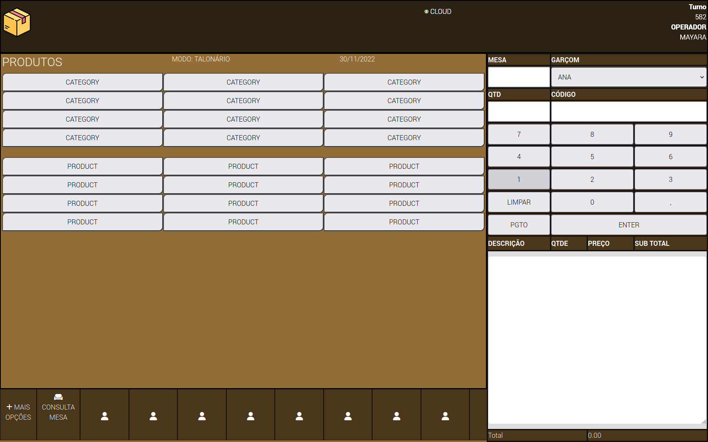
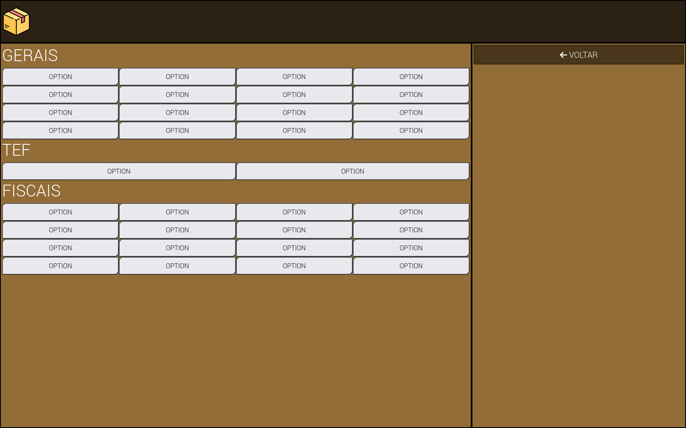
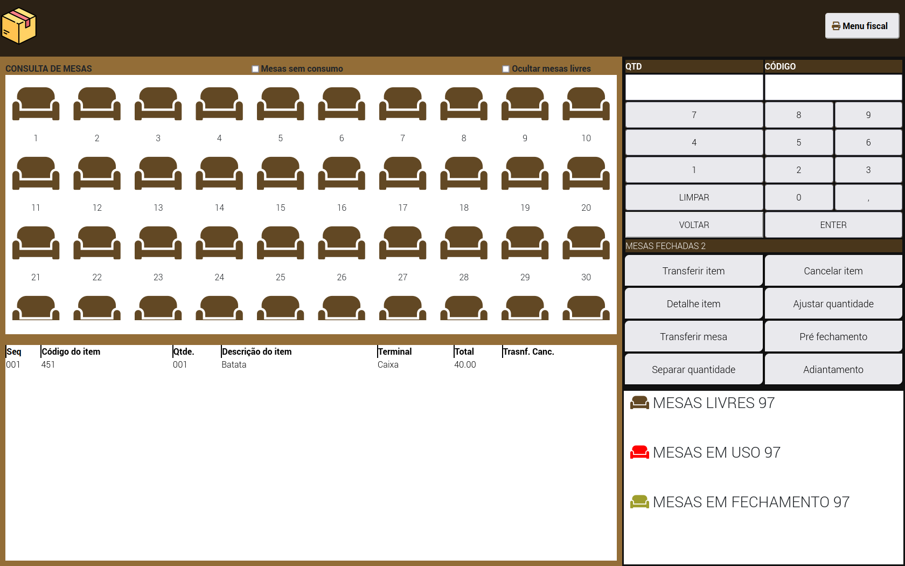

# Sistema ERP Papelax
**EM COSTRUÇÃO**
:wrench:

Screen Principal

Mais Opções de Menu

Tela de Satus de Todas as Mesas

Sistema de ERP desenvolvido com função de atender estabelecimentos, para gerar pedidos.

Ps.: Usar em tela cheia 'F11';

Linguagens usadas:
- 

- 

- 

- 

- 

- MySQL DB
